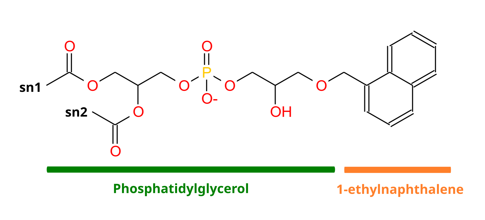

---
Complex lipid mixtures and assembling a lipid from known fragments
---

<hr>

Adapted from the ["Lipid bilayers - Part I: Self-assembly"](https://cgmartini.nl/docs/tutorials/Martini3/LipidsI/) and ["Lipid bilayers - Part II: Complex mixtures"](https://cgmartini.nl/docs/tutorials/Martini3/LipidsII/) Martini 3 Tutorials.

<hr>

### Summary
- [`Introduction`](#introduction)
- [`Complex mixtures with Insane`](#complex-mixtures-with-insane)
   - [`Analysis — hexagonality`](#analysis-hexagonality)
- [`Adding a new lipid headgroup: 1-ethylnaphthalene-PG`](#adding-a-new-lipid-headgroup-1-ethylnaphthalene-pg)
   - [`Creating the 1-ethylnaphthalene-PG topology`](#creating-the-1-ethylnaphthalene-pg-topology)
   - [`Adding 1-ethylnaphthalene-PG to Insane`](#adding-1-ethylnaphthalene-pg-to-insane)
- [`Tools and scripts used in this tutorial`](#tools-and-scripts-used-in-this-tutorial)
- [`References`](#references)

### Introduction
<hr>

The Martini coarse-grained (CG) model was originally developed for lipids<sup>[[1,2]](#references)</sup>. The underlying philosophy of Martini is to build an extendable CG model based on simple modular building blocks and to use only few parameters and standard interaction potentials to maximize applicability and transferability. Martini 3 greatly expanded the number of possible interactions, but retains this building-block approach<sup>[[3]](#references)</sup>. Due to the modularity of Martini, a large set of different lipid types has been parameterized. Their parameters are available with the [Martini 3 release archive](https://cgmartini-library.s3.ca-central-1.amazonaws.com/1_Downloads/ff_parameters/martini3/martini_v300.zip). In this tutorial, you will learn how to set up multicomponent bilayers with lipids from this collection, and how to assemble a new lipid from known fragments.

When setting up large and/or complex bilayers it is convenient to start with a bilayer close to equilibrium. This can be done by concatenating (e.g. using `gmx genconf`) and/or altering previously formed bilayers, but an easier approach is to use a bilayer formation program such as `insane.py`<sup>[[4]](#references)</sup> (available [here](https://github.com/Tsjerk/Insane)).

> **_Note:_** This tutorial assumes you are familiar with running Martini 3 simulations with
GROMACS, and with the organization of the particle and molecule topologies bundled with
the Martini 3 release. Depending on the version of `Insane` you run, and on whether you run the supplied analysis, you will need to have installed the numpy and MDAnalysis Python packages. You can typically install them via the pip command:

``` bash
pip3 install --user numpy mdanalysis
```

### Complex mixtures with Insane
<hr>

`Insane` (INSert membrANE) is a CG building tool that generates membranes by distributing
lipids over a grid. Lipid structures are derived from simple template definitions. Many are
already included with the program (see below on how to add new ones). The program uses
two grids, one for the inner and one for the outer leaflet, and distributes the lipids randomly over the grid cells with numbers according to the relative quantities specified. This allows for building asymmetric bilayers with specific lipid compositions. The program also allows for adding solvent and ions, using a similar grid protocol to distribute them over a 3D grid. Finally, `Insane` script can also be used to set up a complex (or simple!) bilayer system including membrane protein. Additional information about the functionality of `Insane` can be found by running `insane.py -h`.

Because `Insane` deals mostly with structure generation, it can be used for both Martini 2 and 3 lipids, to the extent that they keep the same number of beads and mapping. However, beware that this may not be always true for future Martini 3 lipid models. Conversely, not all the lipid types you’ll find available in `Insane` have been implemented in Martini 3.

You can find [here](https://cgmartini-library.s3.ca-central-1.amazonaws.com/0_Tutorials/m3_tutorials/LipidsII/LipidBilayers_Part2.tar) the tutorial’s input files. Unpack the archive and enter the directory `complex-bilayers/`. We will create with `insane.py` a fully hydrated 3:1 mole ratio bilayer of dibehenoyl-phosphatidylcholine (DBPC) : dilinoleyl-phosphatidylcholine (DIPC), with physiological ion concentrations. DBPC has long saturated chains (22:0), whereas DIPC’s are shorter and polyunsaturated (18:2). Because of its saturation, DBPC has a gel-to-liquid transition temperature of 348 K; DIPC’s transition occurs at 216 K <sup>[[5]](#references)</sup>. By simulating a mixture of these lipids at an intermediate temperature, we can expect the formation of two coexisting phases: a gel one enriched in DBPC, and a liquid one enriched in DIPC. In this tutorial we will be running a simulation at 283K, using DBPC and DIPC as opposite extremes to ensure a successful separation.

Start by running `insane.py`:

``` bash
python insane.py -salt 0.15 -x 25 -y 25 -z 11 -sol W -o membrane.gro -l DIPC:1 -l DBPC:3 -p topol.top
```

This will generate an initial configuration for the system `membrane.gro` (Fig. 1A) and a starting point for a working topology `topol.top`, which you must complete and correct. Your `topol.top` should look something like this: 

``` bash
#include "martini_v3.0.0.itp"
#include "martini_v3.0.0_solvents_v1.itp"
#include "martini_v3.0.0_phospholipids_v1.itp"
#include "martini_v3.0.0_ions_v1.itp"

[ system ]
; name
INSANE! Membrane UpperLeaflet>DIPC:DBPC=1.0:3.0 LowerLeaflet>DIPC:DBPC=1.0:3.0

[ molecules ]
; name  number
...
```

Then, energy minimize the structure and gently equilibrate the system using the provided `.mdp` files. Note, because this simulation contains multiple components you will have to make an index file (using `gmx make_ndx`) and group all the lipids together and all the solvent together to fit the specified groups in the `.mdp` files; the `.mdp` files provided expect the index group names `Bilayer` and `Solvent`. 


``` bash
gmx make_ndx -f membrane.gro -o index.ndx
  > 2|3
  > name 8 Bilayer
  > 4|7
  > name 9 Solvent
  > q
```

After creating your index file `index.ndx` you are ready to perform an energy minimization.

``` bash
gmx grompp -f em.mdp -c membrane.gro -p topol.top -o min.tpr -n index.ndx -maxwarn 1
gmx mdrun -s min.tpr -v -c minimized.gro
```

As all the bilayer lipids and solvent were placed on a grid (Fig. 1A), even after minimization they can still be in an energetically unfavorable state. Due to the large forces involved it is sometimes (but not always) necessary to run a few equilibrium simulations using a short time step (1-10 fs) before running production simulations with longer Martini time steps (we will be using 20 fs). The initial grid order imposed by `insane.py` should relax in a few ns (Fig. 1B), we recommend simulating for 5-30 ns using the Berendsen pressure coupling algorithm, to relax the membrane area:

``` bash
gmx grompp -f eq.mdp -c minimized.gro -p topol.top -o eq.tpr -n index.ndx -maxwarn 1
gmx mdrun -s eq.tpr -v -c equilibrated.gro
```

Before switching to Parrinello-Rahman for the production run:

``` bash
gmx grompp -f md.mdp -c equilibrated.gro -p topol.top -o phase_sep.tpr -n index.ndx
gmx mdrun -deffnm phase_sep -v -c phase_sep.gro
```

This mixture separates in about one microsecond at a temperature of 283 K (Fig. 1C,D,E). If you don’t want to wait that long for your simulation, a sample run is provided [here](https://cgmartini-library.s3.ca-central-1.amazonaws.com/0_Tutorials/m3_tutorials/LipidsII/phase_sep.xtc).

If you have VMD installed and named your `.tpr` file and output trajectory `phase_sep.tpr`, `phase_sep.xtc`, respectively, you can load a similar visualization to that in Fig. 1 by running the `do_vmd.sh` script.

![Figure 1 | Gel-liquid phase separation in a 3:1 DBPC:DIPC mixture. A) Structure immediately after construction by `insane.py` B) After a 20 ns long simulation the grid structure is gone. C,D,E) After about 1µs at 283 K this lipid mixture phase separates into ld and so domains; D and E show the top view of the simulation, and in E only the first bead of each acyl tail of the top leaflet is represented, highlighting the gel-phase hexagonal packing (VMD’s use of multi-frame position averaging further highlights the honeycomb pattern). In all panels DBPC is in blue and DIPC in red.](Fig1.png)

#### Analysis — hexagonality
<hr>

This system can be subjected to several types of analysis (see [here](https://cgmartini.nl/docs/tutorials/Martini3/LipidsI/) for general examples). Some specific analyses can be used to characterize this phase separation. Here we’ll quantify the ‘hexagonality’ of the lipid tail packing along the phase transition. In this measurement, that looks only at the tails’ first beads (see Fig 1B to understand why), a lipid tail is said to be hexagonally packed if:

 * its first bead has at least 6 neighboring beads within 6 Å;
 * all of its 6 closest neighbors have themselves at least 2 neighbors within 6 Å.

These criteria may yield some false positives and some false negatives, but are simple enough
for this application (beware that different studies may employ different criteria for
hexagonality). You can find the script `hexagonality.py` in the folder `../scripts`. This will compute hexagonality for every frame, and outputs a `hexagonality.xvg` you can quickly plot with xmgrace. Make the script executable, if needed, run it, and appreciate the quantitative view of the degree of phase separation along time:

``` bash
../scripts/hexagonality.py -f phase_sep.xtc -s phase_sep.tpr
xmgrace hexagonality.xvg
```

You have now prepared, simulated and analyzed a phase-separating binary mixture of DIPC and DBPC lipids. Molecular simulations have a limited numerical accuracy, and this can sometimes create temperature imbalances — particularly in phase-separating systems<sup>[[6]](#references)</sup>. As an extra step, it would be wise to also check the temperature of the separated parts and see if there are any imbalances limiting or exacerbating the phase separation.

### Adding a new lipid headgroup: 1-ethylnaphthalene-PG
<hr>

When working with complex lipid bilayer systems, you might find that your lipid of interest
is not yet available in the Martini lipidome. If so, it might be necessary for you to parameterize a lipid headgroup yourself. In this part of the tutorial, we will use the small molecule parametrized in the previous tutorial as a lipid headgroup to create a 1-ethylnaphthalene-PG lipid as an example.

<!-- Lysyl-PG is a membrane lipid in several gram-positive bacteria, such as Staphylococcus
aureus, which has been shown to confer a higher level of antimicrobial resistance to cationic
host defense peptides <sup>[[7]](#references)</sup>. Lysyl-PG consists of the ester of phosphatidylglycerol (PG) with the amino acid lysine (Fig 2). However, even though the lysine and PG topologies are available for Martini 3, there is no conjugated lysyl-PG topology yet. -->



<!--CC(=O)OCC(COP(=O)([O-])OCC(O)COCc1cccc2ccccc12)OC(C)=O -->

#### Creating the 1-ethylnaphthalene-PG topology
<hr>

To create the 1-ethylnaphthalene-PG topology, we will combine the small molecule parametrized in the previous tutorial (1-ethylnaphthalene) and POPG
topologies for Martini 3 by employing a simple conjugation, assuming a bond between the
ethyl group of the small molecule (`C1`) and the glycerol of the PG lipid (`GL0`) with the same characteristics as the
phosphate – glycerol bond (`PO4 – GL0`) already in place.

Enter the directory `NewHeadgroup/` within the tutorial’s archive. Start by finding the topology for POPG within the Martini 3 phospholipid topologies (`./martini_v3.0.0_phospholipids_v1.itp`), and the topology for 1-ethylnaphthalene (ENAP) created in the previous tutorial. Create a new file named `ENAP_PG.itp` and copy over the two topologies.

Take a moment to look at the two topologies. These two must now be combined onto a single
topology, taking care not to break any of the bonded parameters already in place. The
simplest way of doing this is by using the POPG topology as a template and adding the ENAP
parameters on top. As such, start by renaming the molecule by changing the name in the `[ moleculetype ]` section to ENAPG. We can then start merging the `[ atoms ]` section by adding
the list of ENAP atoms/beads to the top of the POPG atoms already in place. Care must now
be taken to correctly renumber all of the atom entries as well as to change the residue names
to ENAPG.

At this point, your `[ moleculetype ]` and `[ atoms ]` sections should look something like this:

``` bash
[moleculetype]
; molname nrexcl
ENAPG 1
[atoms]
; id type resnr residu atom cgnr charge
   1  TC3    1  ENAPG   C1   1    0         ;ENAP
   2  TC5    1  ENAPG   R2   2    0     45   
   3  TC5    1  ENAPG   R3   3    0     45   
   4  TC5    1  ENAPG   R4   4    0      0
   5  TC5    1  ENAPG   R5   5    0     45   
   6  TC5    1  ENAPG   R6   6    0     45  
   7   P4    1  ENAPG  GL0   7    0         ;POPG
   8   Q5    1  ENAPG  PO4   8 -1.0
   9 SN4a    1  ENAPG  GL1   9    0
  10  N4a    1  ENAPG  GL2   10   0
  11   C1    1  ENAPG  C1A   11   0
(continues …)
```

Now take a look at the bonded parameters in place in the `[bonds]` and `[angles]` sections.
Notice that since we renumbered the atom list, the POPG bonded parameters no longer
correspond to the correct atoms/beads. To fix this we simply need to update the numbering on
the bonded potentials to the current bead numbers:

> The previous harmonic bond definition:

``` bash
[bonds]
; i j funct length force.c.
  1 2   1     0.36 7000 ;GL0 – PO4 bond
(…)
```

> After renumbering will now be:

``` bash
[bonds]
; i j funct length force.c.
  7 8   1    0.36   7000 ;GL0 – PO4 bond
(…)
```

Renumber the POPG bonded parameters in the `[ bonds ]` and `[ angles ]` sections. After
you’ve done this we can now add the ENAP bonded parameters. The ENAP topology contains
2 bonds, 5 constraints, 3 improper dihedrals, 1 virtual site and exclusions. Since we added the ENAP atoms/beads first in the `[ atoms ]`
section we can simply add those to the list without needing to renumber them.

At this point we will now have the two topologies fully merged, however, the ENAP and
POPG moieties are not yet connected together! To connect them together we must add an
additional bonded potential, linking the POPG glycerol (`GL0`) to the ethyl group of the ENAP molecule (`C1`).
To do this we will assume that the bond in place is similar to the `PO4 – GL0` in place. As
such, create a new bonded potential linking the `GL0` and `C1` beads with the same potential
type, bond length and force constant as that of the `PO4 – GL0` bond. 

<!-- Note that now that the glycerol group of the PG moiety is forming an bond with the ENAP molecule, the chemical properties of the `GL0` bead will be different from those when it was free. As such, we must change the bead type to account for the decrease in polarity from the loss of the hydroxyl group. Taking other Martini 3 models as examples, and with inspiration from the “Martini 3.0 Bible” <sup>[[5]](#references)</sup>  we can tentatively lower the `GL0` bead’s polarity from P4 polarity to N3a.  -->
The ENAP-PG topology is now complete.

***
> **_Note_** that this was a “coarse” approach to the parameterization of a lipid headgroup, wher some assumptions were made for the sake of simplicity and brevity (e.g. assuming the `GL0 – C1` ester bond behaves as the `PO4 – GL0` bond, assuming the small molecule's conformation dynamics
remain the same when bonded to POPG, assuming the modified glycerol moiety is correctly
represented by a P4 bead, etc.). However, this model could serve as a starting point for the
refinement of a finer, more accurate model, focusing on the linkage details: bonds, angles,
and dihedrals, as well as a finer tuning of the glycerol bead particle type. Refinement of lipid models typically use atomistic MD models of the same lipid as reference for their conformational dynamics. Additionally, other theoretical or experimental parameters are also
used as reference targets, such as area per lipid. Refer to the tutorials on small molecule
parameterization where some of these aspects are tackled in more detail.

#### Adding 1-ethylnaphthalene-PG to `Insane`
<hr>

Having created a topology for ENAP-PG we now want to incorporate it in bilayers assembled
by insane. However, since this is a new lipid topology, there are no available templates for
our ENAP-PG lipid in insane, and we must define it ourselves. 

Lipids in `insane` are defined schematically, based on templates. These templates roughly define the x,y,z pseudocoordinates for each of the CG beads. Adding a new template to `insane` is as simple as defining the position of each of the lipid beads in this pseudocoordinate system. Due to its smooth energy landscape, Martini is quite robust and much more tolerant to distortions of the starting structures than, for example, atomistic simulations. This allows us to construct complex membranes from very simple lipid templates. (See the `insane` publication for more details <sup>[[1]](#references)</sup>.) While different versions of `insane` have slightly different template formatting (compare with the [GitHub version](https://github.com/Tsjerk/Insane), for instance), the overall approach is very similar. Use your text editor of choice to open the `scripts/insane.py` file and look for the DPPC definition.

``` bash
# PROTOLIPID (diacylglycerol), 18 beads
#
# 1-3-4-6-7--9-10-11-12-13-14 < -- This is the Lipid template
# \| |/ |
# 2 5 8-15-16-17-18-19-20
## Diacyl glycerols
moltype = "lipid"
lipidsx[moltype]=( 0, .5, 0, 0, .5, 0, 0, .5, 0, 0, 0, 0, 0, 0, 1, 1, 1, 1, 1, 1)
lipidsy[moltype]=( 0, 0, 0, 0, 0, 0, 0, 0, 0, 0, 0, 0, 0, 0, 0, 0, 0, 0, 0, 0)
lipidsz[moltype]=(10, 9, 9, 8, 8, 7, 6, 6, 5, 4, 3, 2, 1, 0, 5, 4, 3, 2, 1, 0)
lipidsa.update({ # 1 2 3 4 5 6 7 8 9 10 11 12 13 14 15 16 17 18 19 20
    "DPPC":(moltype, " - - - NC3 - PO4 GL1 GL2 C1A C2A C3A C4A - - C1B C2B C3B C4B - -
"),
(…)
```

A lipid template is defined by setting the relative x,y,z pseudocoordinates for each of the
particles in the pseudotemplate in `lipidsx`, `lipidsy` and `lipidsz`, respectively. Each lipid entry will then populate the particles in the template as required. If you scroll around `insane.py` you will notice that some families of lipids will have their own templates, such as glycolipids or cardiolipins.

Note that the order in which the atoms are defined in the topology matters when defining the
lipid template. While lipid atoms in Martini are typically roughly ordered from top to bottom
(outermost headgroup bead to innermost acyl chain bead) this may not always be the case
(e.g. phosphoinositol phosphates are defined after the headgroup sugar ring when they are
typically the outermost beads). This is the case with our topology, where the we define first the bead that is connected wih the lipid
(C1) and only after the more superficial R2-R6 beads. While we could re-order and adapt our
topology to fit one of the pre-existing templates, we will create our own `insane.py` template specific to ENAP-PG.

Start by drawing out the template for ENAP-PG, using the DPPC or POPG template as a guide.
If you are struggling with visualizing the structure, pen and paper are your friends! Having
drawn the template, assign x,y,z pseudocoordinates for each of the beads, based on the
preexisting templates. In our case, every bead from the phosphate bead (PO4) down should
match the default diacylglycerol template. Do not pay too much attention to the distances
between beads since, as it was previously mentioned, Martini is quite robust in handling
rough starting conformations. Distances of 0.5 or 1 between beads are typical. 

While it is worth noting that there are many valid templates, in the end, your ENAP-PG template should look something like this (note the difference in z-positions relative to the existing diacylglycerol templates of `moltype = "lipid"`):

``` bash
# ENAP-PG
# This is the new ENAP-PG lipid template
moltype = "lipid"
lipidsx[moltype] = ( 0, 0, 0, 0, 0, 0, 0, 0, 0, .5, 0, 0, 0, 0, 0, 0, 1, 1, 1, 1, 1, 1)
lipidsy[moltype] = ( 0, 0, 0, 0, 0, 0, 0, 0, 0, 0, 0, 0, 0, 0, 0, 0, 0, 0, 0, 0, 0, 0)
lipidsz[moltype] = ( 9, 10, 11, 10.5, 10, 11, 8, 7, 6, 6, 5, 4, 3, 2, 1, 0, 5, 4, 3, 2, 1, 0)
lipidsa.update({
    "ENAPG": (moltype, "C1 R2 R3 R4 R5 R6 GL0 PO4 GL1 GL2 C1A D2A C3A C4A - - C1B C2B C3B C4B -- "),
})
```

If you’ve correctly added this entry to `insane.py`, you should now be able to assemble
membranes containing ENAP-PG. Assemble a membrane composed of 5:1 POPG:ENAP-PG
using insane:

``` bash
python2 insane.py -l POPG:5 -l ENAPG:1 -x 25 -y 25 -z 11 -pbc cubic -sol W -o membrane.gro -p topol.top
```

And use it as a starting point to run a simulation with this complex membrane mixture, as described in the [Complex mixtures with Insane](#complex-mixtures-with-insane) section.
If you are using the version of `insane` that we pack with the tutorial, you can further refine it by adding ENAPG to the charges dictionary, which will allow you to use insane’s `-salt` and `-neutral` flags to get ionic strength and system neutralization in one go.

You now have a topology for a custom lipid, implemented in a way to be flexibly used by `insane` for quick membrane building. Good job! When doing this with real-life cases of new lipids, don't forget to share your parameters with the community for added impact!

### Tools and scripts used in this tutorial
<hr>

 - `GROMACS` ([http://www.gromacs.org/](http://www.gromacs.org/))
 - `insane.py` (downloadable [here](../../../downloads/tools/proteins-and-bilayers.qmd#insane))
 - `MDAnalysis` ([https://www.mdanalysis.org](http://www.mdanalysis.org/))

### References
<hr>


[1] Marrink, S. J., De Vries, A. H., and Mark, A. E. (2004) Coarse grained model for semiquantitative lipid simulations. J. Phys. Chem. B 108, 750–760. DOI:10.1021/jp036508g

[2] Marrink, S. J., Risselada, H. J., Yefimov, S., Tieleman, D. P., and De Vries, A. H. (2007) The MARTINI force field: coarse grained model for biomolecular simulations. J. Phys. Chem. B 111, 7812–7824. DOI:10.1021/jp071097f

[3] Souza, P. C. T., Alessandri, R., et al. (2021) Martini 3: a general purpose force field for coarse-grained molecular dynamics. Nat. Methods 18, 382–388. DOI: 10.1038/s41592-021-01098-3

[4] Wassenaar, T. A., Ingólfsson, H. I., et al. Computational Lipidomics with insane: A
Versatile Tool for Generating Custom Membranes for Molecular Simulations (2015) J. Chem.
Theory Comput. 11, 2144–2155. DOI:10.1021/acs.jctc.5b00209

[5] Thermotropic Phase Transitions of Pure Lipids in Model Membranes and Their
Modifications by Membrane Proteins, Dr. John R. Silvius, Lipid-Protein Interactions, John
Wiley & Sons, Inc., New York, 1982

[6] Thallmair, S., Javanainen, M., Fábián, F., Martinez-Seara, H., Marrink, S.J., Nonconverged Constraints Cause Artificial Temperature Gradients in Lipid Bilayer Simulations (2021) J. Phys. Chem. B 125(33), 9537–9546. DOI:10.1021/acs.jpcb.1c03665

[7] Kilelee, E., Pokorny, Y., Yeaman, M. R., and Bayer, A. S. Lysyl-Phosphatidylglycerol Attenuates Membrane Perturbation Rather than Surface Association of the Cationic Antimicrobial Peptide 6W-RP-1 in a Model Membrane System: Implications for Daptomycin Resistance (2010) Antimicrob. Agents Chemother. 54, 4476–4479. DOI:10.1128/AAC.00191-10
